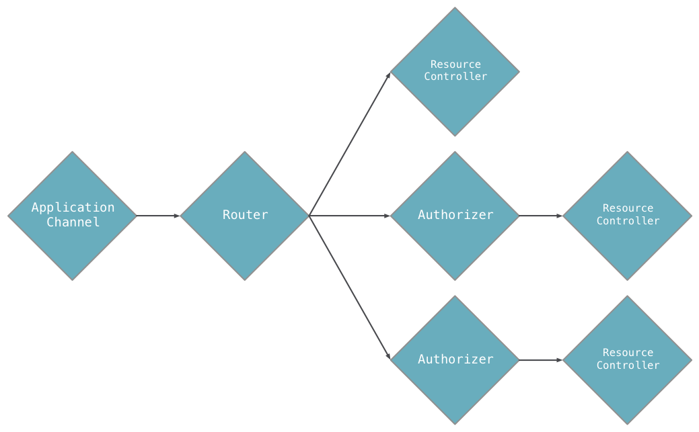

## Dart Web Frameworks Introduction

### First web server powered by Aqueduct

* [SEE:https://aqueduct.io/](https://aqueduct.io/)

*  [ORIGINAL:Building RESTful Web APIs with Dart, Aqueduct, and PostgreSQL — Part 1](https://itnext.io/building-restful-web-apis-with-dart-aqueduct-and-postgresql-3cc9b931f777)

#### Aqueduct:

An object-oriented, multi-threaded HTTP framework mobile developers will love.

####  install Aqueduct:

    pub global activate aqueduct

####  Change to working directory and create our project:

    aqueduct create websvr30 && cd websvr30    

####  Aqueduct Application Architecture

The building blocks of an Aqueduct application are instances of Controller. A Controller is the only thing that can respond to HTTP requests. The logic for an application is written in the methods of this type and its subclasses.

Controllers are linked together to create an *application channel*. An application channel is a series of controllers that a request flows through to be verified and fulfilled.

An application channel always starts at an instance of ApplicationChannel (a subclass of Controller). When an application receives an HTTP request, it adds it to the ApplicationChannel. A ApplicationChannel has a Router (also a subclass of Controller) that splits the channel based on the path of the request. For example, a request with the path /users will go down one part of the channel, while a /things request will go down another.

An application has exactly one ApplicationChannel subclass; it must implement the entryPoint method. For example, the diagram above looks like this in code:

    class AppChannel extends ApplicationChannel {
      @override
      Controller get entry {
        final router = new Router();

        router
          .route("/a")
          .link(() => new AController());

        router
          .route("/b")
          .link(() => new Authorizer(...))
          .link(() => new BController());

        router
          .route("/c")
          .link(() => new Authorizer(...))
          .link(() => new CController());   

        return router;
      }
    }

####  Aqueduct Project Structure and Organization

An Aqueduct project is a directory that contains, at minimum, the following file structure:

    pubspec.yaml
    lib/
      application_name.dart
  
The name of any Dart application is defined by the name key in `pubspec.yaml`. In order for aqueduct serve to run your application, there must be a .dart file in `lib/` with that same name. This is your application library file and it must declare a ApplicationChannel subclass or import a file that does. This is the bare minimum requirement to run an Aqueduct application. (See Deploying for more details on running applications.)

For organizing applications of reasonable size, we recommend the following structure:

    pubspec.yaml
    config.src.yaml
    config.yaml
    lib/
      application_name.dart
      channel.dart  
      controller/
        user_controller.dart
      model/
        user.dart
    test/
      user_controller_test.dart
      harness/
        app.dart

The required `pubspec.yaml` and `lib/application_name.dart` files are present alongside a few others:

* `config.yaml`:A configuration file for the running application.
* `config.src.yaml`:A template for config.yaml.
* `channel.dart`:A file solely for the **ApplicationChannel** of an application. This file should be exported from **application_name.dart**.
* `controller/`:A directory for Controller subclass files.
* `model/`:A directory for ManagedObject<T> subclass files.
* `test/harness/app.dart`:A test harness) for automated testing.

Feel free to create other subdirectories in lib/ for organizing other types of files.    

For example, after `aqueduct create websvr30`,We should now be in the websvr directory with all the project files. For now we’ll focus on:

    bin/
        main.dart
    lib/
        channel.dart
        websvr30.dart
    pubspec.yaml

Now we can start the application using either commands below:

    aqueduct serve # or `dart bin/main.dart`

> TIP`:Instead, `aqueduct serve` and `dart bin/main.dart` have different behaviors. It seems `aqueduct serve` always listen to the port 8081(or through `config.yaml` may be?), although we specified 8080:

    ..configuration.port = 8080;

#### About the "'unnecessary_brace_in_string_interp' is not a recognized lint rule" lint message

just put a `#` in front of the line as comment.

#### Aqueduct and dart:io

Aqueduct runs on top of dart:io and relies on its HttpServer implementation. When an Aqueduct application is started, one or more HttpServer instances are bound to the port specified by aqueduct serve. For each HTTP request, an instance of Request is created to wrap the HttpRequest from dart:io. The Request is added to a ApplicationChannel, sending it through the channel of Controllers until it is responded to.

##### Remove Request from the application channel

In rare circumstances, you may choose to remove a Request from the application channel and manipulate the request with dart:io only. Once removed, it is your responsibility to respond to the request by setting properties on and closing the HttpRequest.response. To take a request out of the channel, simply return null from a Controller:

    @override
    Controller get entryPoint {
    final router = new Router();

    router
        .route("/bypass_aqueduct")
        .linkFunction((req) async {
        req.response.statusCode = 200;
        req.response.close();

        return null;
        });

    return router;
    }

This technique is valuable when Aqueduct can't do something you want it to do or when using websockets.

