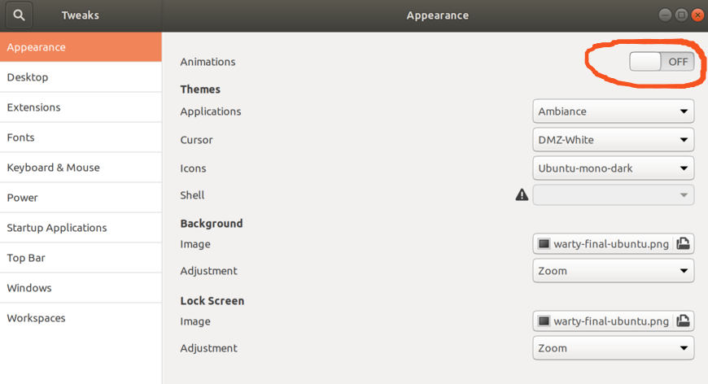

<!-- TOC -->

- [ubuntu linux 桌面技巧](#ubuntu-linux-桌面技巧)
    - [REF:](#ref)
    - [高分屏相关问题](#高分屏相关问题)
    - [How To Get Ubuntu To Boot Before Windows](#how-to-get-ubuntu-to-boot-before-windows)
        - [Use efibootmgr To Change The Boot Order Within Ubuntu:](#use-efibootmgr-to-change-the-boot-order-within-ubuntu)
    - [如何在崩溃后重启桌面](#如何在崩溃后重启桌面)
    - [桌面死机的处理](#桌面死机的处理)
    - [图形处理软件GIMP安装失败报错相关依赖库无法安装](#图形处理软件gimp安装失败报错相关依赖库无法安装)
    - [Ubuntu中设定点击DOCK图标最小化应用.](#ubuntu中设定点击dock图标最小化应用)
    - [How to disable animations in Ubuntu 17.10 or 18.04?](#how-to-disable-animations-in-ubuntu-1710-or-1804)
    - [安装Sogou拼音再次卸载之后,软件更新报错](#安装sogou拼音再次卸载之后软件更新报错)
    - [6 Ways to Speed Up Your Ubuntu PC](#6-ways-to-speed-up-your-ubuntu-pc)
    - [Enable additional repositories for more software](#enable-additional-repositories-for-more-software)
    - [安装Gnome扩展](#安装gnome扩展)
    - [安装多媒体相关软件](#安装多媒体相关软件)
    - [关于GDM问题(a stop job is running for session c1 of user root 1 min 30 s)](#关于gdm问题a-stop-job-is-running-for-session-c1-of-user-root-1-min-30-s)
    - [创建指向文件夹的快捷方式到dock](#创建指向文件夹的快捷方式到dock)
    - [在文件管理器中,`Ctrl+D`快捷键可加入书签](#在文件管理器中ctrld快捷键可加入书签)
    - [在文件管理器中,点击右上角的 Newtab按钮可使用多个页签](#在文件管理器中点击右上角的-newtab按钮可使用多个页签)
    - [安装文件管理器扩展](#安装文件管理器扩展)
    - [Ubuntu下的Chrome浏览器占用内存过多](#ubuntu下的chrome浏览器占用内存过多)
    - [Linux下按进程实时统计网络带宽利用率](#linux下按进程实时统计网络带宽利用率)
    - [User and group management related](#user-and-group-management-related)
        - [/etc/passwd and /etc/shadow](#etcpasswd-and-etcshadow)
        - [change file/dir ownner,group,and permissions](#change-filedir-ownnergroupand-permissions)
        - [`sudo cd dir` cann't work?](#sudo-cd-dir-cannt-work)
    - [Command replacement](#command-replacement)
    - [包管理工具apt](#包管理工具apt)
        - [参考文档：](#参考文档)
        - [ubuntu software updata出错:](#ubuntu-software-updata出错)
        - [apt-get 常用实例](#apt-get-常用实例)
    - [缩放图像的工具](#缩放图像的工具)
    - [显示文件的前几行内容](#显示文件的前几行内容)
    - [linux之sed用法](#linux之sed用法)
    - [Linux常用操作](#linux常用操作)
        - [执行 程序：“.”（ 点号）](#执行-程序-点号)
        - [别名： alias](#别名-alias)
        - [任务前后台切换：bg、 fg、 jobs:](#任务前后台切换bg-fg-jobs)
        - [设置Ubuntu终端字体](#设置ubuntu终端字体)
        - [EFI GRUB2启动菜单总是30秒](#efi-grub2启动菜单总是30秒)

<!-- /TOC -->

## ubuntu linux 桌面技巧

### REF:

1. [Things to do After Installing Ubuntu 18.04](https://itsfoss.com/things-to-do-after-installing-ubuntu-18-04/)
1. [24 Must Have Essential Linux Applications](https://itsfoss.com/essential-linux-applications/)
1. [Top 20 GNOME Extensions You Should Be Using Right Now](https://itsfoss.com/best-gnome-extensions/)

### 高分屏相关问题
1. 高分屏需要通过system setting的display设定分辨率

### How To Get Ubuntu To Boot Before Windows

After windows10 upgrade, the grub boot menu will NOT be the first boot efi, but the ubuntu installation is still there, althought we cann't boot ubuntu. Here is the solution:

#### Use efibootmgr To Change The Boot Order Within Ubuntu:

from: [https://www.lifewire.com/fix-uefi-bootloader-issues-when-dual-booting-2200655](https://www.lifewire.com/fix-uefi-bootloader-issues-when-dual-booting-2200655)

Simply follow these steps:

1. Insert your live Ubuntu USB drive into the computer Open a terminal window and type the following command:

2. (optional)sudo apt-get-install efibootmgr 
Enter your password and press Y when asked whether you want to continue.
A list will appear with the following information:
3. run command in terminal: `sudo efibootmgr`

        BootCurrent: 0001
        Timeout: 0
        Bootorder: 0001, 0002, 0003
        Boot 0001 Windows
        Boot 0002 Ubuntu
        Boot 0003 EFI USB Drive

This list is only indicative of what you might see.The BootCurrent shows the item that is currently booting and so you will notice that the BootCurrent in the list above matches against Windows.

4. You can change the boot order using the following command:

    `sudo efibootmgr -o 0002,0001,0003`

This will change the boot order so that Ubuntu is first and then Windows and then the USB drive. 
Exit the terminal window and reboot your computer(Remember to remove your USB drive) 
A menu should now appear with the option to boot Ubuntu or Windows.

### 如何在崩溃后重启桌面

> 要重启桌面，按下Alt + F2 将会打开一个命令菜单，输入r并按下回车。

### 桌面死机的处理

> CTRL+ALT+F1[F2]似乎是两个图形终端,CTRL+ALT+F3~F6是字符终端,可以用TOP命令查找,KILL XORG进程即可.

### 图形处理软件GIMP安装失败报错相关依赖库无法安装

> 在Software & updates 设定中开启Canonical相关的软件即可找到.

### Ubuntu中设定点击DOCK图标最小化应用.

from: [http://tipsonubuntu.com/2018/04/15/click-icon-minimize-application-window-ubuntu-18-04/](http://tipsonubuntu.com/2018/04/15/click-icon-minimize-application-window-ubuntu-18-04/)

>    * `gsettings set org.gnome.shell.extensions.dash-to-dock click-action 'minimize'|'previews'`  //其中preview是原始值
>    * 以上可以使用`gsettings reset org.gnome.shell.extensions.dash-to-dock click-action`恢复.
>    * 使用Dconf Editor软件.参考上面的值修改.

### How to disable animations in Ubuntu 17.10 or 18.04?

1. To disable animations,first install Gnome Tweak Tool:

    `sudo apt install gnome-tweak-tool`

> Then launch tool either from command line by running gnome-tweak-tool or by using dash and searching for Tweak. On the first tab Appearance there is a toggle switch Animations. That's it!

### 安装Sogou拼音再次卸载之后,软件更新报错

> 在用 sudo apt-get update 时出现这样的报错：

> W: GPG error: http://archive.ubuntukylin.com:10006/ubuntukylin xenial InRelease: The following signatures couldn't be verified because the public key is not available: NO_PUBKEY D259B7555E1D3C58

    E: The repository 'http://archive.ubuntukylin.com:10006/ubuntukylin xenial InRelease' is not signed.
    N: Updating from such a repository can't be done securely, and is therefore disabled by default.
    N: See apt-secure(8) manpage for repository creation and user configuration details.

解决方案:

>  `sudo apt-key adv --keyserver keyserver.ubuntu.com --recv-keys <PUBKEY>`

这里 <PUBKEY> 为D259B7555E1D3C58

然后再

>  `sudo apt-get update`

### 6 Ways to Speed Up Your Ubuntu PC

REFER TO: [6 Ways to Speed Up Your Ubuntu PC](https://www.howtogeek.com/115797/6-ways-to-speed-up-ubuntu/)

1. Install Preload: `sudo apt-get install preload`
1. Control Startup apps: DOCK->search startup,可以看到启动应用.如果要看到所有的系统启动应用,可以运行`sudo sed -i "s/NoDisplay=true/NoDisplay=false/g" /etc/xdg/autostart/*.desktop`,然后重新查看启用应用就可以看到系统应用了.
1. 使用更轻量级的桌面和应用.
1. setting里面关闭search
1. 编辑GRUB,加速系统启动.`sudo vi /etc/default/grub` Change the value of GRUB_TIMEOUT to 2,然后,`sudo update-grub2` 使改变生效.
1. 参考上面一条关闭动画.

###  Enable additional repositories for more software

Ubuntu has several repositories from where it provides software for your system. These repositories are:

1. Main – Free and open-source software supported by Ubuntu team
1. Universe – Free and open-source software maintained by the community
1. Restricted – Proprietary drivers for devices.
1. Multiverse – Software restricted by copyright or legal issues.
1. Canonical Partners – Software packaged by Ubuntu for their partners 
1. Enabling all these repositories will give you access to more software and proprietary drivers.

### 安装Gnome扩展

> `sudo apt install gnome-shell-extensions`
> 在软件库中有很多扩展,包括天气,网络,系统等.

### 安装多媒体相关软件

> `sudo apt install ubuntu-restricted-extras`

### 关于GDM问题(a stop job is running for session c1 of user root 1 min 30 s)

> `sudo vi /etc/systemd/system.conf`

找到DefaultTimeoutStopSec=90s  //此处修改为10S即可.

然后执行：systemctl daemon-reload

### 创建指向文件夹的快捷方式到dock

> 参考资料:
1. [Desktop Entry Specification](https://specifications.freedesktop.org/desktop-entry-spec/latest/index.html)
1. [How To Add Shortcuts To Favorites In Gnome-Shell [Ubuntu]](https://geekitdown.com/how-to-add-shortcuts-to-favorites-in-gnome-shell-ubuntu/)

>  在`"/usr/share/applications"`目录下,创建`devprojects.desktop`文件:

    #!/usr/bin/env xdg-open
    [Desktop Entry]
    Version=1.0
    Type=Application
    Icon[en_US]=gnome-panel-launcher
    Exec=nautilus /home/tanger/devprojects
    Name[en_US]=devprojects
    Comment[en_US]=devprojects
    Name=devprojects
    Comment=devprojects
    Icon=gnome-panel-launcher

### 在文件管理器中,`Ctrl+D`快捷键可加入书签

### 在文件管理器中,点击右上角的 Newtab按钮可使用多个页签

### 安装文件管理器扩展

> `sudo apt-get install nautilus-image-converter`

### Ubuntu下的Chrome浏览器占用内存过多

> 关闭Setting里面的高级设定里面的GPU加速.

### Linux下按进程实时统计网络带宽利用率

> 适用于Linux操作系统的开源网络监视工具.比如说,你可以用命令iftop来检查带宽使用情况. netstat用来查看接口统计报告,还有top监控系统当前运行进程.但是如果你想要找一个能够按进程实时统计网络带宽利用率,那么NetHogs就是你所需要的唯一工具.

`sudo nethogs`

### User and group management related

> In GUI, Ubuntu software ,search `gnome-system-tools` and install;

OR

> `useradd` in command line.

#### /etc/passwd and /etc/shadow

> `cat /etc/passwd`

    tanger:x:1000:1000:tanger,,,:/home/tanger:/bin/bash
    postgres:x:121:127:PostgreSQL administrator,,,:/var/lib/postgresql:/bin/bash

The fields, in order from left to right, are:[1]

1. User name: the string a user would type in when logging into the operating system: the logname. Must be unique across users listed in the file.
1. Information used to validate a user's password; in most modern uses, this field is usually set to "x" (or "*", or some other indicator) with the actual password information being stored in a separate shadow password file. On Linux systems, setting this field to an asterisk ("*") is a common way to disable direct logins to an account while still preserving its name, while another possible value is "*NP*" which indicates to use an NIS server to obtain the password.[2] Without password shadowing in effect, this field would typically contain a cryptographic hash of the user's password (in combination with a salt).
1. user identifier number, used by the operating system for internal purposes. It need not be unique.
1. group identifier number, which identifies the primary group of the user; all files that are created by this user may initially be accessible to this group.
1. Gecos field, commentary that describes the person or account. Typically, this is a set of comma-separated values including the user's full name and contact details.
1. Path to the user's home directory.
1. Program that is started every time the user logs into the system. For an interactive user, this is usually one of the system's command line interpreters (shells).

> `sudo cat /etc/shadow`

    tanger:$1$EJkrNPNC$Xv2Mrg791YiK5hIml36tc1:17648:0:99999:7:::
    postgres:*:17683:0:99999:7:::

1. User login name
1. salt and hashed password OR a status exception value e.g.:
    * "$id$salt$hashed", the printable form of a password hash as produced by crypt (C), where "$id" is the algorithm used. (On GNU/Linux, "$1$" stands for MD5, "$2a$" is Blowfish, "$2y$" is Blowfish (correct handling of 8-bit chars), "$5$" is SHA-256 and "$6$" is SHA-512,[4] other Unix may have different values, like NetBSD. Key stretching is used to increase password cracking difficulty, using by default 1000 rounds of modified MD5,[5] 64 rounds of Blowfish, 5000 rounds of SHA-256 or SHA-512.[6] The number of rounds may be varied for Blowfish, or for SHA-256 and SHA-512 by using e.g. "$6$rounds=50000$".
    * Empty string – No password, the account has no password (reported by passwd on Solaris with "NP").[7]
    * "!" – the account is password locked, user will be unable to log in via password authentication but other methods (e.g. ssh key) may be still allowed.[8]
    * "*LK*" or "*" – the account is locked, user will be unable to log in via password authentication but other methods (e.g. ssh key) may be still allowed.[8]
    * "!!" – the password has never been set (RedHat)[9]
1. Days since epoch of last password change
1. Days until change allowed
1. Days before change required
1. Days warning for expiration
1. Days before account inactive
1. Days since epoch when account expires
Reserved    

#### change file/dir ownner,group,and permissions

    sudo chown postgres:adm postgresql-10-data.log 
    sudo chmod 640 postgresql-10-data.log
    sudo chown -R postgres:postgres data //where -R merns recursive

#### `sudo cd dir` cann't work?

Because cd is not a command. to issue:

    sudo -i -u postgres
    sudo -i //run as root
    su postgres //need login!!

### Command replacement

    $echo ddd \`date\` 

will produce the output:

    ddd Sun Jun 10 00:06:00 CST 2018

 ### How to enable and disable services in  Systemd init
 
Systemd is a system & service manager tool supported by Ubuntu 15.04 and newer releases. The command line tool used for managing services, for instance, starting and stopping, &  enabling and disabling services on boot time.

* To start a service in systemd run the command as shown:

        systemctl start service-name   

* To verify that the service is running, run

        systemctl status service-name   
* To stop the service running service

        systenctl stop service-name

* To enable apache2 service on boot up run

        systemctl enable apache2

* To disable apache2 service on boot up run

        systemctl disable apache2

* To restart the service

        systemctl restart apache2
* To check whether the service is currently configured to start on the next boot up

        systemctl is-enabled apache2
        
* To check whether the service is active

        systemctl is-active apache2               

### 包管理工具apt

#### 参考文档： 

* [APT工作原理](https://blog.csdn.net/buguyiqie/article/details/4948661 "APT工作原理")
* [apt-get常用命令及工作原理](https://blog.csdn.net/mosquito_zm/article/details/63684608 "apt-get常用命令及工作原理")

#### ubuntu software updata出错:

sudo apt-get update出错信息如下:

    E: Repository 'https://storage.googleapis.com/download.dartlang.org/linux/debian unstable Release' changed its 'Origin' value from 'Google, Inc.' to 'Google LLC'
    N: This must be accepted explicitly before updates for this repository can be applied. See apt-secure(8) manpage for details.

>解决方法:

Just run

    sudo apt update
And you will be prompted to accept the new Origin of the repository

    Do you want to accept these changes and continue updating from this repository? [y/N] 
And that’s it.

#### apt-get 常用实例

*    apt-cache search packagename 搜索包
*    apt-cache show packagename 获取包的相关信息，如说*    明、大小、版本等
*    apt-get install packagename 安装包
*    apt-get install packagename --reinstall 重新安*    装包
*    apt-get -f install 修复安装”-f = –fix-missing”
*    apt-get remove packagename 删除包
*    apt-get remove packagename --purge 删除包，包括*    删除配置文件等
*    apt-get update 更新源
*    apt-get upgrade 更新已安装的包
*    apt-get dist-upgrade 升级系统
*    apt-get dselect-upgrade 使用 dselect 升级
*    apt-cache depends packagename 了解使用依赖
*    apt-cache rdepends packagename 是查看该包被哪些包*    依赖
*    apt-get build-dep packagename 安装相关的编译环境
*    apt-get source packagename 下载该包的源代码
*    apt-get clean 清理无用的包
*    apt-get autoclean 清理无用的包
*    apt-get check 检查是否有损坏的依赖

### 缩放图像的工具

> `convert -scale 50%x50% installcppext.png installcppextsLittle.png`

### 显示文件的前几行内容

> The following example will show first 3 lines from /etc/passwd file:

    `head -3 /etc/passwd`

### linux之sed用法

> 原始文档:[linux之sed用法](http://www.cnblogs.com/dong008259/archive/2011/12/07/2279897.html)

sed是一个很好的文件处理工具，本身是一个管道命令，主要是以行为单位进行处理，可以将数据行进行替换、删除、新增、选取等特定工作，下面先了解一下sed的用法
sed命令行格式为：

        sed [-nefri] ‘command’ 输入文本        

常用选项：

        -n∶使用安静(silent)模式。在一般 sed 的用法中，所有来自 STDIN的资料一般都会被列出到萤幕上。但如果加上 -n 参数后，则只有经过sed 特殊处理的那一行(或者动作)才会被列出来。
        -e∶直接在指令列模式上进行 sed 的动作编辑；
        -f∶直接将 sed 的动作写在一个档案内， -f filename 则可以执行 filename 内的sed 动作；
        -r∶sed 的动作支援的是延伸型正规表示法的语法。(预设是基础正规表示法语法)
        -i∶直接修改读取的档案内容，而不是由萤幕输出。       

常用命令：

        a   ∶新增， a 的后面可以接字串，而这些字串会在新的一行出现(目前的下一行)～
        c   ∶取代， c 的后面可以接字串，这些字串可以取代 n1,n2 之间的行！
        d   ∶删除，因为是删除啊，所以 d 后面通常不接任何咚咚；
        i   ∶插入， i 的后面可以接字串，而这些字串会在新的一行出现(目前的上一行；
        p  ∶列印，亦即将某个选择的资料印出。通常 p 会与参数 sed -n 一起运作～
        s  ∶取代，可以直接进行取代的工作哩！通常这个 s 的动作可以搭配正规表示法例如 1,20s/old/new/g 就是啦！

举例：（假设我们有一文件名为ab）

    删除某行

     [root@localhost ruby] # sed '1d' ab              #删除第一行 
     [root@localhost ruby] # sed '$d' ab              #删除最后一行
     [root@localhost ruby] # sed '1,2d' ab           #删除第一行到第二行
     [root@localhost ruby] # sed '2,$d' ab           #删除第二行到最后一行

    显示某行

     [root@localhost ruby] # sed -n '1p' ab           #显示第一行 
     [root@localhost ruby] # sed -n '$p' ab           #显示最后一行
     [root@localhost ruby] # sed -n '1,2p' ab        #显示第一行到第二行
     [root@localhost ruby] # sed -n '2,$p' ab        #显示第二行到最后一行

　　使用模式进行查询

     [root@localhost ruby] # sed -n '/ruby/p' ab    #查询包括关键字ruby所在所有行
     [root@localhost ruby] # sed -n '/\$/p' ab        #查询包括关键字$所在所有行，使用反斜线\屏蔽特殊含义

　　增加一行或多行字符串

     [root@localhost ruby]# cat ab
     Hello!
     ruby is me,welcome to my blog.
     end
     [root@localhost ruby] # sed '1a drink tea' ab  #第一行后增加字符串"drink tea"
     Hello!
     drink tea
     ruby is me,welcome to my blog. 
     end
     [root@localhost ruby] # sed '1,3a drink tea' ab #第一行到第三行后增加字符串"drink tea"
     Hello!
     drink tea
     ruby is me,welcome to my blog.
     drink tea
     end
     drink tea
     [root@localhost ruby] # sed '1a drink tea\nor coffee' ab   #第一行后增加多行，使用换行符\n
     Hello!
     drink tea
     or coffee
     ruby is me,welcome to my blog.
     end

　　代替一行或多行

     [root@localhost ruby] # sed '1c Hi' ab                #第一行代替为Hi
     Hi
     ruby is me,welcome to my blog.
     end
     [root@localhost ruby] # sed '1,2c Hi' ab             #第一行到第二行代替为Hi
     Hi
     end

　　替换一行中的某部分

　　格式：sed 's/要替换的字符串/新的字符串/g'   （要替换的字符串可以用正则表达式）
     
    [root@localhost ruby] # sed -n '/ruby/p' ab | sed 's/ruby/bird/g'    #替换ruby为bird
    [root@localhost ruby] # sed -n '/ruby/p' ab | sed 's/ruby//g'        #删除ruby

    插入

    [root@localhost ruby] # sed -i '$a bye' ab         #在文件ab中最后行直接输入"bye"

    [root@localhost ruby]# cat ab
    Hello!
    ruby is me,welcome to my blog.
    end
    bye

    删除匹配行

    sed -i '/匹配字符串/d'  filename  （注：若匹配字符串是变量，则需要“”，不是‘’。记得好像是）

    替换匹配行中的某个字符串

    sed -i '/匹配字符串/s/替换源字符串/替换目标字符串/g' filename
    
### Linux常用操作
    
#### 执行 程序：“.”（ 点号）

使用 点号 执行 没有 加 执行 权限 的 脚本 可以 正常 运行 

> [root@ localhost ~]# . ./HelloWorld. sh

#### 别名： alias

alias 可用 于 创建 命令 的 别名，用于简化命令输入。比如：

> [root@ localhost ~]# alias myShutdown=' shutdown -h now'

#### 任务前后台切换：bg、 fg、 jobs:

bg用于将任务放置后台运行，一般与Ctrl+ z、fg、&符号联合使用。典型的使用场景是运行比较耗时的任务。若在前台执行，在任务完成前将会一直占用当前终端，此时 就可以将这类任务放置后台。 

    [root@ localhost ~]# tar -zcf usr. tgz /usr 
    tar: Removing leading `/' from member names 

    #此处 用 Ctrl+ z 组合 键 暂停 前台 任务 
    [1]+ Stopped tar -zcf usr. tgz /usr 
    [root@ localhost ~]# jobs  #查看暂停的 任务， 刚刚的tar任务编号为 1:
    [1]+ Stopped tar -zcf usr. tgz /usr 
    [root@ localhost ~]# bg 1 #放置后台继续运行 
    [1]+ tar -zcf usr. tgz /usr & #tar任务继续运行了
    [root@ localhost ~]# fg 1 #fg把后台任务调至前台运行 
    tar -zcf usr. tgz /usr 
    #可以一开始就将命令放入后台运行 
    [root@ localhost ~]# tar -zcf usr. tgz /usr &
    
#### 设置Ubuntu终端字体

Ctrl+Alt+F3..F6切换终端。
如果在高分屏下，可以通过

    sudo dpkg-reconfigure console-setup

设置终端字体。

#### EFI GRUB2启动菜单总是30秒

    sudo vim /etc/default/grub
    
add:

    GRUB_RECORDFAIL_TIMEOUT=10
and run:

    sudo update-grub

