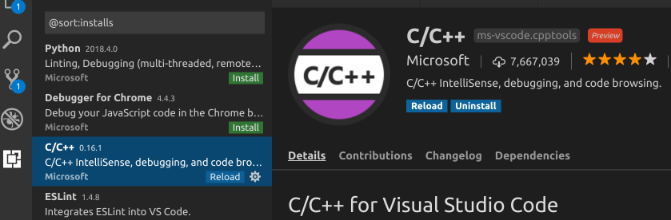

### Linux下使用vscode开发C++程序的环境配置相关问题

##### 安装vscode

* 从Linux相关环境的应用市场安装即可。
* 参考官方文档： [Linux下安装vscode](https://code.visualstudio.com/docs/setup/linux "Linux下安装vscode")

##### vscode and git

*  `git config --global credential.helper wincred`可以不再提示输入密码？测试似乎不行。

> 要用这个才可以:
> 
> `git remote set-url origin https://<USERNAME>:<PASSWORD>@github.com/yourusername/repo.git`

#### Caching your GitHub password in Git

> 1. In Terminal, enter the following:

    $ git config --global credential.helper cache
    # Set git to use the credential memory cache

> 2. To change the default password cache timeout, enter the following:

    $ git config --global credential.helper 'cache --timeout=3600'
    # Set the cache to timeout after 1 hour (setting is in seconds)

##### 安装vscode的c/c++扩展

> 如下图所示:

##### vscode c++扩展需要glibc2.1.8以上,查看glibc版本:

> `ldd --version`

this will output such as:

> ldd (Ubuntu GLIBC 2.27-3ubuntu1) 2.27

##### 安装必须的编译环境

> `sudo apt-get install build-essential`

