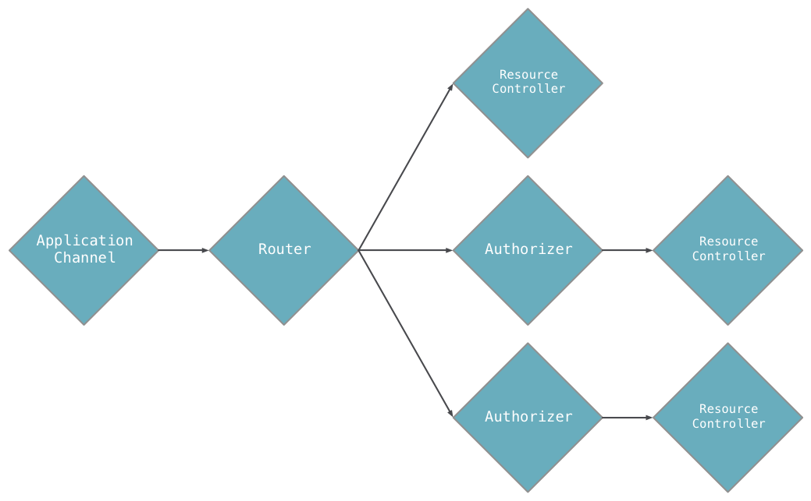
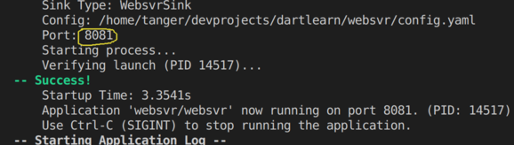

## Linux下使用vscode开发Dart环境配置相关问题

### Install Dart VM SDK:

> [REF:https://www.dartlang.org/tools/sdk#install](https://www.dartlang.org/tools/sdk#install)

### Howto Use startup lib stagehand

    $ pub global activate stagehand
    $ stagehand console-full  //create console demo app.

> TIP`:Because use flutter first, dart has been already installed with flutter pachage tool. and when examine the `/usr/lib/dart/bin`, we can find that `pub` is alreay there. so,just add this path to $PATH by adding to ~/.profile and run `$ .profile`. and also when cann't find the `stagehand` script.

    PATH="$PATH:/usr/lib/dart/bin"
    PATH="$PATH":"~/.pub-cache/bin"

### DartLang Basic

> Note: The assert() call is ignored in production code. During development, assert(condition) throws an exception unless condition is true.

#### Final and const

If you never intend to change a variable, use final or const, either **instead of var** or **in addition to** a type. A final variable can be set only once; a const variable is a compile-time constant. (Const variables are implicitly final.) A final top-level or class variable is initialized the first time it’s used.

Here’s an example of creating and setting a final variable:

    final name = 'Bob'; // Without a type annotation
    // name = 'Alice';  // Uncommenting this causes an error
    final String nickname = 'Bobby';

Use const for variables that you want to be compile-time constants. If the const variable is at the class level, mark it **`static const`**. Where you declare the variable, set the value to a compile-time constant such as a number or string literal, a const variable, or the result of an arithmetic operation on constant numbers:

    const bar = 1000000; // Unit of pressure (dynes/cm2)
    const double atm = 1.01325 * bar; // Standard atmosphere

> Note: Instance variables can be final but not const.

Built-in types
The Dart language has special support for the following types:

* numbers
* strings
* booleans
* lists (also known as arrays)
* maps
* runes (for expressing Unicode characters in a string)
* symbols

#### Numbers
Dart numbers come in two flavors:

##### int
Integer values no larger than 64 bits, depending on the platform. On the Dart VM, values can be from -263 to 263 - 1. Dart that’s compiled to JavaScript uses JavaScript numbers, allowing values from -253 to 253 - 1.

##### double
64-bit (double-precision) floating-point numbers, as specified by the IEEE 754 standard.

Both int and double are subtypes of `num`. The num type includes basic operators such as +, -, /, and *, and is also where you’ll find abs(), ceil(), and floor(), among other methods. (Bitwise operators, such as >>, are defined in the int class.) If num and its subtypes don’t have what you’re looking for, the dart:math library might.

    int x = 1;
    int hex = 0xDEADBEEF;
    
If a number includes a decimal, it is a double. Here are some examples of defining double literals:

    double y = 1.1;
    double exponents = 1.42e5;

Here’s how you turn a string into a number, or vice versa:

    // String -> int
    var one = int.parse('1');
    assert(one == 1);

    // String -> double
    var onePointOne = double.parse('1.1');
    assert(onePointOne == 1.1);

    // int -> String
    String oneAsString = 1.toString();
    assert(oneAsString == '1');

    // double -> String
    String piAsString = 3.14159.toStringAsFixed(2);
    assert(piAsString == '3.14');

#### Strings

A Dart string is a sequence of UTF-16 code units. You can use either single or double quotes to create a string:

#### Lists
Perhaps the most common collection in nearly every programming language is the array, or ordered group of objects. In Dart, arrays are List objects, so most people just call them lists.

Dart list literals look like JavaScript array literals. Here’s a simple Dart list:

    var list = [1, 2, 3];
Note: The analyzer infers that list has type List<int>. If you try to add non-integer objects to this list, the analyzer or runtime raises an error. For more information, read about **`type inference`**.

Lists use zero-based indexing, where 0 is the index of the first element and list.length - 1 is the index of the last element. You can get a list’s length and refer to list elements just as you would in JavaScript:

    var list = [1, 2, 3];
    assert(list.length == 3);
    assert(list[1] == 2);

    list[1] = 1;
    assert(list[1] == 1);
To create a list that’s a compile-time constant, add const before the list literal:

    var constantList = const [1, 2, 3];
    // constantList[1] = 1; // Uncommenting this causes an error.

#### Maps
In general, a map is an object that associates keys and values. Both keys and values can be any type of object. Each key occurs only once, but you can use the same value multiple times. Dart support for maps is provided by map literals and the Map type.

Here are a couple of simple Dart maps, created using map literals:

    var gifts = {
      // Key:    Value
      'first': 'partridge',
      'second': 'turtledoves',
      'fifth': 'golden rings'
    };

    var nobleGases = {
      2: 'helium',
      10: 'neon',
      18: 'argon',
    };
> Note: The analyzer infers that gifts has the type Map<String, String> and nobleGases has the type Map<int, String>. If you try to add the wrong type of value to either map, the analyzer or runtime raises an error. For more information, read about type inference.

You can create the same objects using a Map constructor:

    var gifts = new Map();
    gifts['first'] = 'partridge';
    gifts['second'] = 'turtledoves';
    gifts['fifth'] = 'golden rings';

    var nobleGases = new Map();
    nobleGases[2] = 'helium';
    nobleGases[10] = 'neon';
    nobleGases[18] = 'argon';

Add a new key-value pair to an existing map just as you would in JavaScript:

    var gifts = {'first': 'partridge'};
    gifts['fourth'] = 'calling birds'; // Add a key-value pair
Retrieve a value from a map the same way you would in JavaScript:

    var gifts = {'first': 'partridge'};
    assert(gifts['first'] == 'partridge');

If you look for a key that isn’t in a map, you get a null in return:

    var gifts = {'first': 'partridge'};
    assert(gifts['fifth'] == null);

Use .length to get the number of key-value pairs in the map:

    var gifts = {'first': 'partridge'};
    gifts['fourth'] = 'calling birds';
    assert(gifts.length == 2);

To create a map that’s a compile-time constant, add const before the map literal:

    final constantMap = const {
        2: 'helium',
        10: 'neon',
        18: 'argon',
    };

    // constantMap[2] = 'Helium'; // Uncommenting this causes an error.

#### Runes
In Dart, runes are the UTF-32 code points of a string.

Unicode defines a unique numeric value for each letter, digit, and symbol used in all of the world’s writing systems. Because a Dart string is a sequence of UTF-16 code units, expressing 32-bit Unicode values within a string requires special syntax.

The usual way to express a Unicode code point is \uXXXX, where XXXX is a 4-digit hexidecimal value. For example, the heart character (♥) is \u2665. To specify more or less than 4 hex digits, place the value in curly brackets. For example, the laughing emoji (😆) is \u{1f600}.

The String class has several properties you can use to extract rune information. The codeUnitAt and codeUnit properties return 16-bit code units. Use the runes property to get the runes of a string.

The following example illustrates the relationship between runes, 16-bit code units, and 32-bit code points:

    main() {
      var clapping = '\u{1f44f}';
      print(clapping);
      print(clapping.codeUnits);
      print(clapping.runes.toList());

      Runes input = new Runes(
          '\u2665  \u{1f605}  \u{1f60e}  \u{1f47b}  \u{1f596}  \u{1f44d}');
      print(new String.fromCharCodes(input));
    }

> Note: Be careful when manipulating runes using list operations. This approach can easily break down, depending on the particular language, character set, and operation. For more information, see How do I reverse a String in Dart? on Stack Overflow.

#### How do I reverse a String in Dart?

    var input = "Music \u{1d11e} for the win"; // Music 𝄞 for the win
    print(input.split('').reversed.join()); // niw eht rof

The split function explicitly warns against this problem (with an example):

> Splitting with an empty string pattern ('') splits at UTF-16 code unit boundaries and not at rune boundaries[.]

There is an easy fix for this: instead of reversing the individual code-units one can reverse the runes:

    var input = "Music \u{1d11e} for the win"; // Music 𝄞 for the win
    print(new String.fromCharCodes(input.runes.toList().reversed)); // niw eht rof 𝄞 cisuM

But that's not all. Runes, too, can have a specific order. This second obstacle is much harder to solve. A simple example:

    var input =  'Ame\u{301}lie'; // Amélie
    print(new String.fromCharCodes(input.runes.toList().reversed)); // eiĺemA
Note that the accent is on the wrong character.

#### Symbols
A Symbol object represents an operator or identifier declared in a Dart program. You might never need to use symbols, but they’re invaluable for APIs that refer to identifiers by name, because minification changes identifier names but not identifier symbols.

To get the symbol for an identifier, use a symbol literal, which is just # followed by the identifier:

    #radix
    #bar
Symbol literals are compile-time constants.

#### Functions

Dart is a true object-oriented language, so even functions are objects and have a type, Function. This means that functions can be assigned to variables or passed as arguments to other functions. You can also call an instance of a Dart class as if it were a function. For details, see `Callable classes`.

Here’s an example of implementing a function:

    bool isNoble(int atomicNumber) {
      return _nobleGases[atomicNumber] != null;
    }
Although Effective Dart recommends `type annotations for public APIs`, the function still works if you omit the types:

    isNoble(atomicNumber) {
      return _nobleGases[atomicNumber] != null;
    }
For functions that contain just one expression, you can use a shorthand syntax:

    bool isNoble(int atomicNumber) => _nobleGases[atomicNumber] != null;

The => expr syntax is a shorthand for { return expr; }. The => notation is sometimes referred to as **`fat arrow syntax`**.

> Note: Only an expression—not a statement—can appear between the arrow (=>) and the semicolon (;). For example, you can’t put an if statement there, but you can use a conditional expression.

A function can have two types of parameters: required and optional. The required parameters are listed first, followed by any optional parameters.

##### Optional parameters
Optional parameters can be either positional or named, **but not both**.

###### Optional named parameters

When defining a function, use **`{param1, param2, …}`** to specify named parameters:

    /// Sets the [bold] and [hidden] flags ...
    void enableFlags({bool bold, bool hidden}) {
      // ...
    }

When calling a function, you can specify named parameters using paramName: value. For example:

    enableFlags(bold: true, hidden: false);

default values for named parameters:

    /// Sets the [bold] and [hidden] flags ...
    void enableFlags({bool bold = false, bool hidden = false}) {
      // ...
    }

    // bold will be true; hidden will be false.
    enableFlags(bold: true);    

###### Optional positional parameters
Wrapping a set of function parameters **`in [] marks`** them as optional positional parameters:

    String say(String from, String msg, [String device]) {
      var result = '$from says $msg';
      if (device != null) {
        result = '$result with a $device';
      }
      return result;
    }
Here’s an example of calling this function without the optional parameter:

    assert(say('Bob', 'Howdy') == 'Bob says Howdy');

default values for positional parameters:

    String say(String from, String msg,
        [String device = 'carrier pigeon', String mood]) {
      var result = '$from says $msg';
      if (device != null) {
        result = '$result with a $device';
      }
      if (mood != null) {
        result = '$result (in a $mood mood)';
      }
      return result;
    }   

> You can also pass lists or maps as default values. The following example defines a function, doStuff(), that specifies a default list for the list parameter and a default map for the gifts parameter.

    void doStuff(
        {List<int> list = const [1, 2, 3],
        Map<String, String> gifts = const {
          'first': 'paper',
          'second': 'cotton',
          'third': 'leather'
        }}) {
      print('list:  $list');
      print('gifts: $gifts');
    }    

##### Functions as first-class objects
You can pass a function as a parameter to another function. For example:

    void printElement(int element) {
      print(element);
    }

    var list = [1, 2, 3];

    // Pass printElement as a parameter.
    list.forEach(printElement);

> TIP:when we say `first-class-object`,means the function is `AS SAME AS VARIABLE`,can be assgined to variables, or, as be passed as parameter to other functions.

You can also assign a function to a variable, such as:

    var loudify = (msg) => '!!! ${msg.toUpperCase()} !!!';
    assert(loudify('hello') == '!!! HELLO !!!');

This example uses an anonymous function. More about those in the next section.

##### Anonymous functions
Most functions are named, such as main() or printElement(). You can also create a nameless function called an anonymous function, or sometimes a lambda or closure. You might assign an anonymous function to a variable so that, for example, you can add or remove it from a collection.

An anonymous function looks similar to a named function— zero or more parameters, separated by commas and optional type annotations, between parentheses.

The code block that follows contains the function’s body:

    ([[Type] param1[, …]]) { 
      codeBlock; 
    }; 

The following example defines an anonymous function with an untyped parameter, item. The function, invoked for each item in the list, prints a string that includes the value at the specified index.

    var list = ['apples', 'bananas', 'oranges'];
    list.forEach((item) {
      print('${list.indexOf(item)}: $item');
    });

### First web server powered by Aqueduct

* [SEE:https://aqueduct.io/](https://aqueduct.io/)

*  [ORIGINAL:Building RESTful Web APIs with Dart, Aqueduct, and PostgreSQL — Part 1](https://itnext.io/building-restful-web-apis-with-dart-aqueduct-and-postgresql-3cc9b931f777)

#### Aqueduct:

An object-oriented, multi-threaded HTTP framework mobile developers will love.

####  install Aqueduct:

    pub global activate aqueduct

####  Change to working directory and create our project:

    aqueduct create websvr30 && cd websvr30    

####  Aqueduct Application Architecture

The building blocks of an Aqueduct application are instances of Controller. A Controller is the only thing that can respond to HTTP requests. The logic for an application is written in the methods of this type and its subclasses.

Controllers are linked together to create an *application channel*. An application channel is a series of controllers that a request flows through to be verified and fulfilled.

An application channel always starts at an instance of ApplicationChannel (a subclass of Controller). When an application receives an HTTP request, it adds it to the ApplicationChannel. A ApplicationChannel has a Router (also a subclass of Controller) that splits the channel based on the path of the request. For example, a request with the path /users will go down one part of the channel, while a /things request will go down another.

An application has exactly one ApplicationChannel subclass; it must implement the entryPoint method. For example, the diagram above looks like this in code:

    class AppChannel extends ApplicationChannel {
      @override
      Controller get entry {
        final router = new Router();

        router
          .route("/a")
          .link(() => new AController());

        router
          .route("/b")
          .link(() => new Authorizer(...))
          .link(() => new BController());

        router
          .route("/c")
          .link(() => new Authorizer(...))
          .link(() => new CController());   

        return router;
      }
    }

####  Aqueduct Project Structure and Organization

An Aqueduct project is a directory that contains, at minimum, the following file structure:

    pubspec.yaml
    lib/
      application_name.dart
  
The name of any Dart application is defined by the name key in `pubspec.yaml`. In order for aqueduct serve to run your application, there must be a .dart file in `lib/` with that same name. This is your application library file and it must declare a ApplicationChannel subclass or import a file that does. This is the bare minimum requirement to run an Aqueduct application. (See Deploying for more details on running applications.)

For organizing applications of reasonable size, we recommend the following structure:

    pubspec.yaml
    config.src.yaml
    config.yaml
    lib/
      application_name.dart
      channel.dart  
      controller/
        user_controller.dart
      model/
        user.dart
    test/
      user_controller_test.dart
      harness/
        app.dart

The required `pubspec.yaml` and `lib/application_name.dart` files are present alongside a few others:

* `config.yaml`:A configuration file for the running application.
* `config.src.yaml`:A template for config.yaml.
* `channel.dart`:A file solely for the **ApplicationChannel** of an application. This file should be exported from **application_name.dart**.
* `controller/`:A directory for Controller subclass files.
* `model/`:A directory for ManagedObject<T> subclass files.
* `test/harness/app.dart`:A test harness) for automated testing.

Feel free to create other subdirectories in lib/ for organizing other types of files.    

For example, after `aqueduct create websvr30`,We should now be in the websvr directory with all the project files. For now we’ll focus on:

    bin/
        main.dart
    lib/
        channel.dart
        websvr30.dart
    pubspec.yaml

Now we can start the application using either commands below:

    aqueduct serve # or `dart bin/main.dart`

> TIP`:Instead, `aqueduct serve` and `dart bin/main.dart` have different behaviors. It seems `aqueduct serve` always listen to the port 8081(or through `config.yaml` may be?), although we specified 8080:

    ..configuration.port = 8080;

#### About the "'unnecessary_brace_in_string_interp' is not a recognized lint rule" lint message

just put a `#` in front of the line as comment.

#### Aqueduct and dart:io

Aqueduct runs on top of dart:io and relies on its HttpServer implementation. When an Aqueduct application is started, one or more HttpServer instances are bound to the port specified by aqueduct serve. For each HTTP request, an instance of Request is created to wrap the HttpRequest from dart:io. The Request is added to a ApplicationChannel, sending it through the channel of Controllers until it is responded to.

##### Remove Request from the application channel

In rare circumstances, you may choose to remove a Request from the application channel and manipulate the request with dart:io only. Once removed, it is your responsibility to respond to the request by setting properties on and closing the HttpRequest.response. To take a request out of the channel, simply return null from a Controller:

    @override
    Controller get entryPoint {
    final router = new Router();

    router
        .route("/bypass_aqueduct")
        .linkFunction((req) async {
        req.response.statusCode = 200;
        req.response.close();

        return null;
        });

    return router;
    }

This technique is valuable when Aqueduct can't do something you want it to do or when using websockets.

