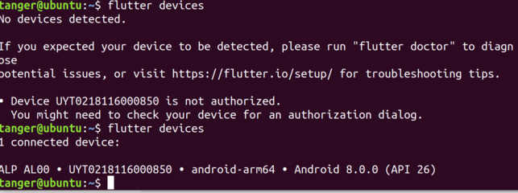

### Linux下使用vscode开发Flutter环境配置相关问题

#### 安装Flutter:

> [Get Started: Install on Linux](https://flutter.io/setup-linux/)

#### Add Flutte bin to PATH:

> Edit $HOME/.profile, add

> `PATH="$PATH:$HOME/devprojects/flutterdev/flutter/bin"` as the last line of the file.

#### Ubuntu下安装Android Studio的问题:

> According to:[Android Studio Install Step Linux.4](https://developer.android.com/studio/install)

中文版本的文档是有错误的.选择English就可以看到:

    If you are running a 64-bit version of Ubuntu, you need to install some 32-bit libraries with the following command:
    
> `sudo apt-get install libc6:i386 libncurses5:i386 libstdc++6:i386 lib32z1 libbz2-1.0:i386`
    
#### Start Android Studio and check for update:

> To launch Android Studio, open a terminal, navigate to the android-studio/bin/ directory, and execute `. ./studio.sh`

> On the Android Studio startup screen, use Configure->Check For Updates to check for AS updates.

#### Run flutter doctor

> Run the following command to see if there are any dependencies you need to install to complete the setup:

> `flutter doctor`

#### Set up your Android device

To prepare to run and test your Flutter app on an Android device, you’ll need an Android device running Android 4.1 (API level 16) or higher.

Enable Developer options and USB debugging on your device. Detailed instructions are available in the Android documentation.
Using a USB cable, plug your phone into your computer. If prompted on your device, authorize your computer to access your device.
In the terminal, run the:

> `flutter devices` 

command to verify that Flutter recognizes your connected Android device.

Start your app by running

> `flutter run`

By default, Flutter uses the version of the Android SDK where your adb tool is based. If you want Flutter to use a different installation of the Android SDK, you must set the ANDROID_HOME environment variable to that installation directory.

#### Get Started: Configure Editor

> [REF:https://flutter.io/get-started/editor/#vscode](https://flutter.io/get-started/editor/#vscode)

Visual Studio Code (VS Code) setup
VS Code: A light-weight editor with Flutter run and debug support.

##### Install VS Code

    VS Code, version 1.20.1 or later.

##### Install the Flutter plugin

* Start VS Code
* Invoke View>Command Palette…
* Type ‘install’, and select the ‘Extensions: Install Extension’ action
* Enter flutter in the search field, select ‘Flutter’ in the list, and click Install
* Select ‘OK’ to reload VS Code

##### Validate your setup with the Flutter Doctor

* Invoke View>Command Palette…
* Type ‘doctor’, and select the ‘Flutter: Run Flutter Doctor’ action
* sReview the output in the ‘OUTPUT’ pane for any issues

#### Get Started: Test Drive

> [REF:https://flutter.io/get-started/test-drive/#vscode](https://flutter.io/get-started/test-drive/#vscode)

##### Create new app

* Start VS Code
* Invoke  **`View>Command Palette…`**
* Type ‘flutter’, and select the **`‘Flutter: New Project’`** action
* Enter a project name (e.g. myapp), and press Enter
* Specify a location to place the project, and press the blue OK button
* Wait for the project creation to continue, and the `main.dart` file to appear

The above command creates a Flutter project directory called myapp that contains a simple demo app that uses Material Components.

In the project directory, the code for your app is in `lib/main.dart`.

##### Run the app

* Make sure a target device is selected in the lower, right-hand corner of VS Code
* Press the F5 button on the keyboard, or invoke **`Debug>Start Debugging`**
* Wait for the app to launch
* If everything works, after the app has been built, you should see your * starter app on your device or simulator.

> TIP: after follow the up steps, i get "Initiliazing gradle" message for a long time... looks like infinite loop. On Ubuntu 18.04, use `sudo apt-get install gradle`, after that, the app is running as expected!!

> TIP: [REF:https://github.com/flutter/flutter/issues/15106](https://github.com/flutter/flutter/issues/15106)

    MacOS, Android Studio 3.0.1

    Try to install gradle manually (https://services.gradle.org/distributions/gradle-4.6-bin.zip), and unzip it
    Open <path_to_flutter_app>/android/gradlew
    Find: CLASSPATH=$APP_HOME/gradle/wrapper/gradle-wrapper.jar
    and replace with: CLASSPATH=<path_to_downloaded_gardle>/gradle-4.6/lib/gradle-launcher-4.6.jar
    Find: exec "$JAVACMD" "${JVM_OPTS[@]}" -classpath "$CLASSPATH" org.gradle.wrapper.GradleWrapperMain "$@"
    and replace with: exec "$JAVACMD" "${JVM_OPTS[@]}" -classpath "$CLASSPATH" org.gradle.launcher.GradleMain "$@"
    flutter run

    For Windows:
    
    Find: set CLASSPATH=%APP_HOME%\gradle\wrapper\gradle-wrapper.jar
    Replace: set CLASSPATH=<path_to_downloaded_gardle>\gradle-4.6\lib\gradle-launcher-4.6.jar

    Find: "%JAVA_EXE%" %DEFAULT_JVM_OPTS% %JAVA_OPTS% %GRADLE_OPTS% "-Dorg.gradle.appname=%APP_BASE_NAME%" -classpath "%CLASSPATH%" org.gradle.wrapper.GradleWrapperMain %CMD_LINE_ARGS%
    Replace: "%JAVA_EXE%" %DEFAULT_JVM_OPTS% %JAVA_OPTS% %GRADLE_OPTS% "-Dorg.gradle.appname=%APP_BASE_NAME%" -classpath "%CLASSPATH%" org.gradle.launcher.GradleMain %CMD_LINE_ARGS%

##### Try a hot reload

Flutter offers a fast development cycle with *`hot reload`*, the ability to reload the code of a live running app without restarting or losing app state. Simply make a change to your source code, tell your IDE or command-line tool that you want to hot reload, and see the change in your simulator, emulator, or device.

* Open the file `lib/main.dart` in your favorite Dart code editor
* Change the string

    'You have pushed the button this many times:' to
    'You have clicked the button this many times:'

* Do not press the ‘Stop’ button; let your app continue to run.
To see your changes invoke **`Save`** (`cmd-s / ctrl-s`), or click the Hot Reload button (the green circular arrow button).
* You should see the updated string in the running app almost immediately.

### Fluter App Basics

#### A Simple Demo

    import 'package:flutter/material.dart';

    void main() => runApp(new MyApp());

    class MyApp extends StatelessWidget {
        @override
        Widget build(BuildContext context) {
            return new MaterialApp(
                title: 'Welcome to Flutter',
                home: new Scaffold(
                    appBar: new AppBar(
                        title: new Text('Welcome to Flutter'),
                    ),
                    body: new Center(
                        child: new Text('Hello World'),
                    ),
                ),
            );
        }
    }

##### Observations

* This example creates a Material app. Material is a visual design language that is standard on mobile and the web. Flutter offers a rich set of Material widgets.

* The main method specifies fat arrow (=>) notation, which is short hand used for one-line functions or methods.

* The app extends StatelessWidget which makes the app itself a widget. In Flutter, almost everything is a widget, including alignment, padding, and layout.

* The Scaffold widget, from the Material library, provides a default app bar, title, and a body property that holds the widget tree for the home screen. The widget subtree can be quite complex.

* A widget’s main job is to provide a build() method that describes how to display the widget in terms of other, lower level widgets.

* The widget tree for this example consists of a Center widget containing a Text child widget. The Center widget aligns its widget subtree to the center of the screen.

#####  Use an external package

1. The pubspec file manages the assets for a Flutter app. In pubspec.yaml, add english_words (3.1.0 or higher) to the dependencies list. The new line is highlighted below:

        dependencies:
        flutter:
            sdk: flutter

        cupertino_icons: ^0.1.0
        english_words: ^3.1.0

1. While viewing the pubspec in Android Studio’s editor view, click Packages get upper right. This pulls the package into your project. You should see the following in the console:

        flutter packages get
        Running "flutter packages get" in startup_namer...
        Process finished with exit code 0

1. In `lib/main.dart`, add the import for english_words, as shown in the highlighted line:

        import 'package:flutter/material.dart';
        import 'package:english_words/english_words.dart';

    As you type, Android Studio gives you suggestions for libraries to import. It then renders the import string in gray, letting you know that the imported library is unused (so far).

1. Use the English words package to generate the text instead of using the string “Hello World”.

    > Tip: “Pascal case” (also known as “upper camel case”), means that each word in the string, including the first one, begins with an uppercase letter. So, “uppercamelcase” becomes “UpperCamelCase”.

1. Make the following changes, as below:

        import 'package:flutter/material.dart';
        import 'package:english_words/english_words.dart';

        void main() => runApp(new MyApp());

        class MyApp extends StatelessWidget {
          @override
          Widget build(BuildContext context) {
            final wordPair = new WordPair.random(); // ++++ add this line
            return new MaterialApp(
              title: 'Welcome to Flutter',
              home: new Scaffold(
                appBar: new AppBar(
                  title: new Text('Welcome to Flutter'),
                ),
                body: new Center(
                  //child: new Text('Hello World'), // Replace this ...
                  child: new Text(wordPair.asPascalCase), //With this text.
                ),
              ),
            );
          }
        }